# LensCraft: dataset, models, active-learning round, and benchmark

Generated 2026-09-15 03:56 from backend `modal`.

## Dataset

| run | class | n | mass fraction | SNR median | residual_rms median | seed |
|---|---|---|---|---|---|---|
| `tr5k_none` | none | 5000 | 0 | 2089 | 0 | 100 |
| `tr5k_sub` | subhalo | 5000 | 0.03 | 2130 | 0.0265 | 101 |
| `tr5k_vor` | vortex | 5000 | 0.03 | 2098 | 0.0269 | 102 |
| `te1k_none` | none | 1000 | 0 | 2106 | 0 | 200 |
| `te1k_sub` | subhalo | 1000 | 0.03 | 2119 | 0.0263 | 201 |
| `te1k_vor` | vortex | 1000 | 0.03 | 2111 | 0.0269 | 202 |
| `uni_none` | none | 667 | 0 | 2106 | 0 | 300 |
| `uni_sub` | subhalo | 667 | 0.03 | 2140 | 0.0267 | 301 |
| `uni_vor` | vortex | 666 | 0.03 | 2098 | 0.0271 | 302 |
| `al_r1` | vortex | 2000 | 0.03 | 2110 | 0.0273 | 1001 |

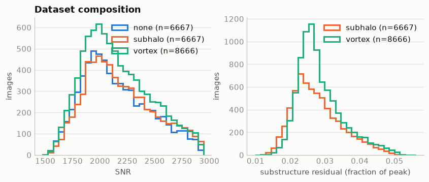

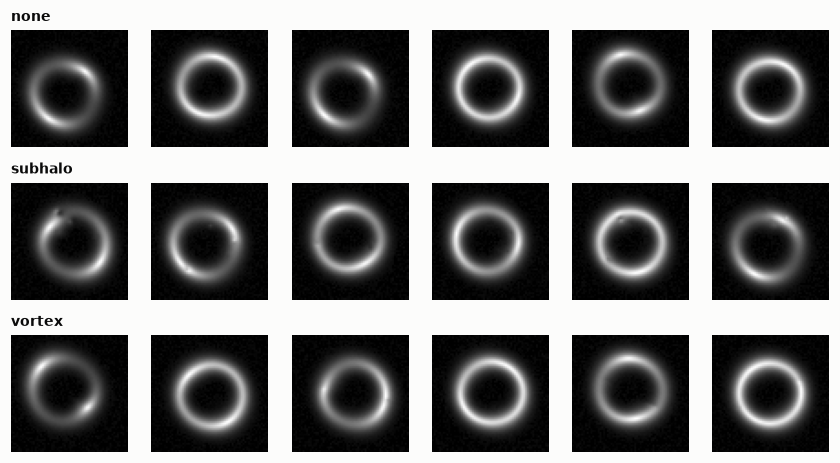

## Model `clf_base_b`

- kind **classifier**, arch **resnet18**, trained on  (12000 train / 3000 val images, 10 epochs, best epoch 10.0)

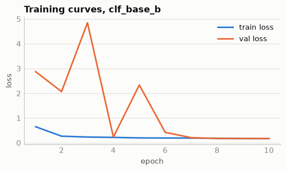

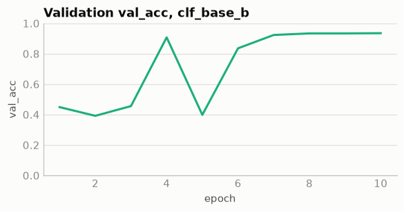

Evaluated on `te1k_none`, `te1k_sub`, `te1k_vor`: **3000 images**, AUC **0.979**

| true \ predicted | none | subhalo | vortex | accuracy |
|---|---|---|---|---|
| none | 1000 | 0 | 0 | 1.000 |
| subhalo | 2 | 963 | 35 | 0.963 |
| vortex | 0 | 178 | 822 | 0.822 |

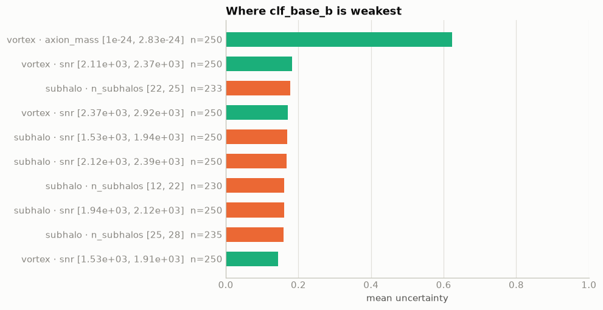

Weakest region: vortex with axion_mass in [1.004e-24, 2.832e-24] (n=250, mean uncertainty 0.623, accuracy 0.288). Proposed 2000 more vortex images there; axion_mass fixed at the cell's geometric midpoint 1.69e-24 eV (vortex length 1.78").

## Model `clf_uni_b`

- kind **classifier**, arch **resnet18**, trained on `tr5k_none`, `tr5k_sub`, `tr5k_vor`, `uni_none`, `uni_sub`, `uni_vor` (13600 train / 3400 val images, 10 epochs, best epoch 8.0)

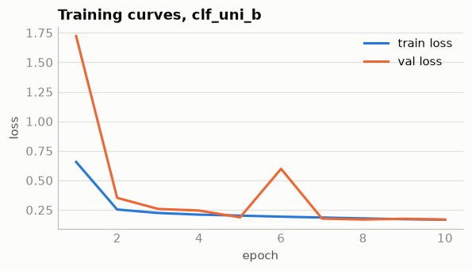

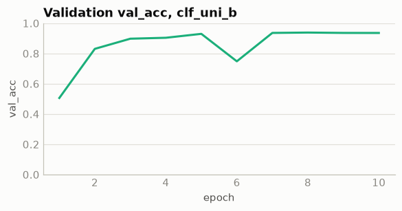

Evaluated on `te1k_none`, `te1k_sub`, `te1k_vor`: **3000 images**, AUC **0.978**

| true \ predicted | none | subhalo | vortex | accuracy |
|---|---|---|---|---|
| none | 1000 | 0 | 0 | 1.000 |
| subhalo | 2 | 972 | 26 | 0.972 |
| vortex | 0 | 181 | 819 | 0.819 |

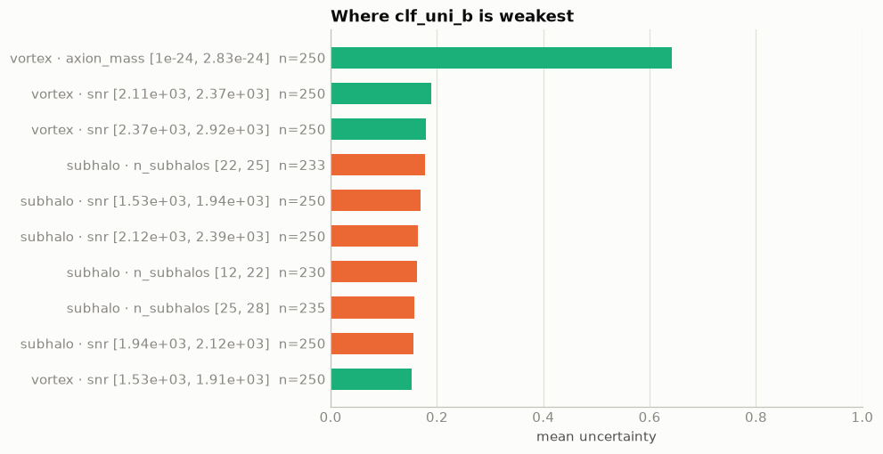

Weakest region: vortex with axion_mass in [1.004e-24, 2.832e-24] (n=250, mean uncertainty 0.642, accuracy 0.276). Proposed 2000 more vortex images there; axion_mass fixed at the cell's geometric midpoint 1.69e-24 eV (vortex length 1.78").

## Model `clf_al_b`

- kind **classifier**, arch **resnet18**, trained on  (13600 train / 3400 val images, 10 epochs, best epoch 10.0)

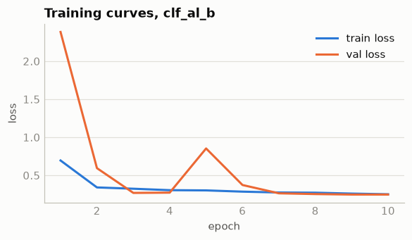

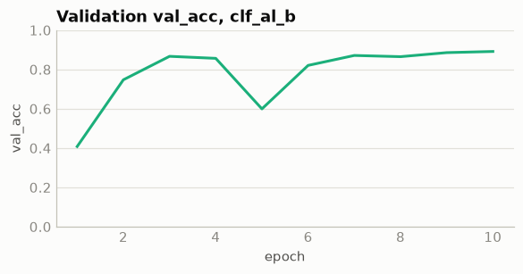

Evaluated on `te1k_none`, `te1k_sub`, `te1k_vor`: **3000 images**, AUC **0.980**

| true \ predicted | none | subhalo | vortex | accuracy |
|---|---|---|---|---|
| none | 1000 | 0 | 0 | 1.000 |
| subhalo | 2 | 794 | 204 | 0.794 |
| vortex | 0 | 94 | 906 | 0.906 |

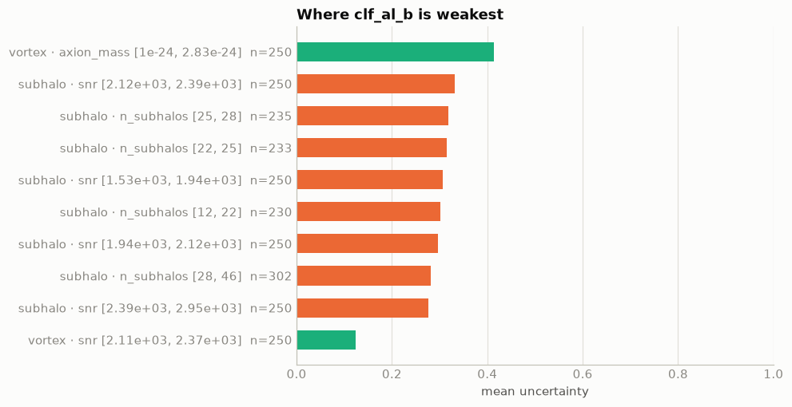

Weakest region: vortex with axion_mass in [1.004e-24, 2.832e-24] (n=250, mean uncertainty 0.414, accuracy 0.624). Proposed 2000 more vortex images there; axion_mass fixed at the cell's geometric midpoint 1.69e-24 eV (vortex length 1.78").

## Model `aae_5k_v2`

- kind **anomaly**, arch **aae**, trained on  (4000 train / 1000 val images, 10 epochs, best epoch ?)

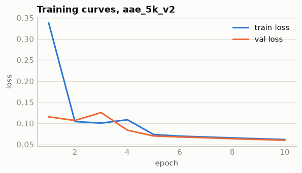

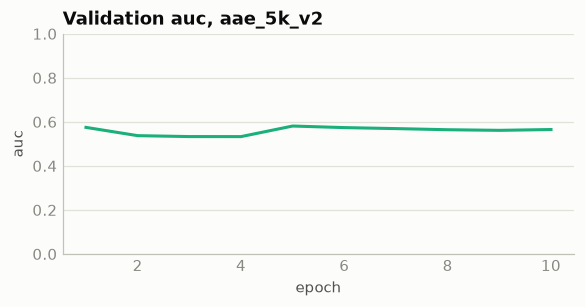

Evaluated on te1k_none, te1k_sub, te1k_vor: 3000 images

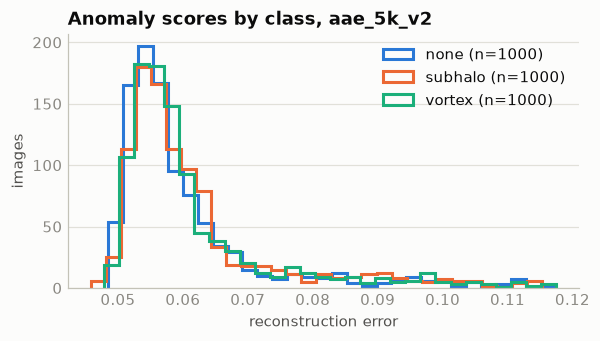

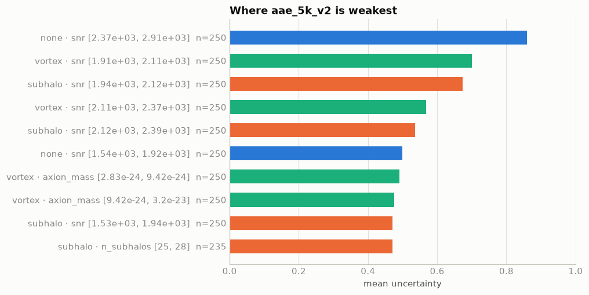

Weakest region: none with snr in [2371, 2908] (n=250, mean uncertainty 0.859, detection rate 0.800). Proposed 2000 more none images there; SNR is not a LensCard field (it follows from source_magnitude / exposure); the proposal keeps the base card and adds more none images so the SNR range [2371, 2908] is better covered.

## Active-learning rounds

| round | weakest cell | new run | images | new model | before | after |
|---|---|---|---|---|---|---|
| 1 | vortex axion_mass [1e-24, 2.83e-24] acc 0.29 | `al_r1` | 2000 | `clf_al_b` | accuracy 0.928, auc 0.979 | accuracy 0.900, auc 0.980 control clf_uni_b (2000 uniform images): accuracy 0.930, auc 0.978 |

## Benchmark

| arm | n | pass | pass@1 | pass@3 | reach | mean requests | mean tokens | mean time |
|---|---|---|---|---|---|---|---|---|
| core | 3 | 3 | 1.00 | 1.00 | 1.00 ± 0.00 | 30 | 857101 | 894 s |
| tool | 3 | 3 | 1.00 | 1.00 | 1.00 ± 0.00 | 6 | 36035 | 103 s |

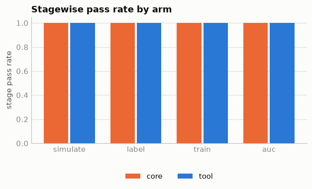

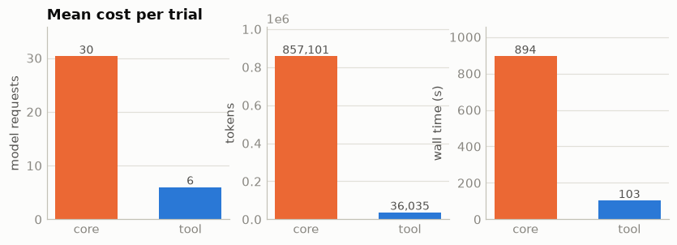

